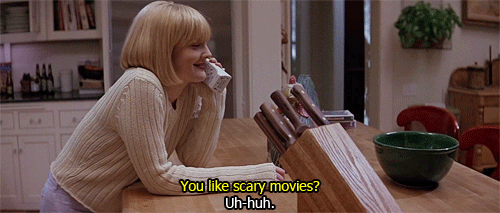

# Do You Like Scary Movies?

- [Web Application Description](#description)
- [Features](#features)
- [Examples](#examples)
- [Future Dev](#future)
- [Credits](#credits)
- [Contact Information](#contact)
- [Links](#links)

## Web Application Description
 
 

 
 

It's time to test your knowledge on horror movies of all genres. Prove to your friends, families, and slasher villains that you're not the one to mess with! You've done your studying and you're ready to throw down, Final Girl style. 

It's simple--
 
 

- Answer 10 questions within the 30 second time limit.
- For every wrong answers, 5 seconds will be deducted from your total time [scared emoji]
- Once you submit your answers, record your score and see how you compare to other users. 

 Which one of you is making their escape? 

## Features

This quiz contains a set of features to more dynamic user interaction.
 
 
- A 30 second countdown timer. The time reduces for every wrong answer
- User results for each question, color coded to show correct and incorrect answers
- The users ability to record their scores 
- Local storage of three highest scores

## Examples

## Future Dev

- Add keyboard screen reading and keystrokes to allow more accessibility for users
- High scores based on number of correct/incorrect answers and the time taken to finish the quiz
- Randomize the questions
- Different modes of play-- easy, regular, hard
- Links to share your results on social media. 

## Credits

Created utilizing the following resources and reference code:

- UW Coding Bootcamp class repo: week 4
-  <a href="https://www.sitepoint.com/simple-javascript-quiz/">Free code reference</a> from Yaphi Berhanu and James Hibbard 
- <a href="https://colorswall.com/palette/264001">Red</a> and <a href="https://colorswall.com/palette/264000">Blue </a> color pallets created by <a href="https://colorswall.com/users/4354/palettes"> Me </a> using colorswall.

## Contact Information

[Kiriludp](https://github.com/kiriludp)
 

[killian.podhajsky@gmail.com](mailto:killian.podhajsky@gmail.com)
 

[Portfolio]()
 

[LinkedIn]()

## Links

[You Like Scary Movies?]()

[Walk Through Video]()